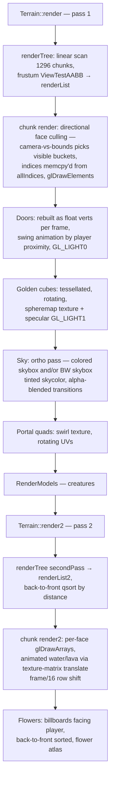

# Rendering Pipeline

## Purpose
Everything drawn on screen: GL state management, chunk meshing, the two terrain
passes, special objects, sky, and the per-vertex data formats.

## Fixed constraints
- **OpenGL ES 1.1, fixed-function.** No shaders anywhere. Lighting effects are baked
  into vertex colors; the only uses of GL lighting are doors and the golden cube's
  env-mapped specular highlight.
- Single 16-bit depth buffer, RGBA8 color, depth attachment discarded before present
  (`EAGLView.mm:303`).

## Important files
- `Classes/Graphics.mm/.h` — static GL state helpers + the vertex struct definitions.
- `Classes/TerrainChunk.mm` — mesh generation (`rebuild2`), VBO upload (`prepareVBO`),
  chunk draw (`render`, `render2`).
- `Classes/Terrain.mm` — frame-level terrain passes, object batches, sky.
- `Classes/Geometry.mm` — the canonical cube/ramp/side/liquid vertex+UV tables and the
  shared `allIndices[32768]` identity index array.
- `Classes/Frustum.mm` — plane extraction + AABB test (`ViewTestAABB`).
- `Classes/Camera.mm` — view matrix from player state.
- `Classes/glu.h`, `project.c` — GLU port used for `gluPerspective`/`gluUnProject`.

## Vertex formats (`Graphics.h:51-84`)
- `vertexStructSmall` — terrain: `GLshort position[3]` + pad, `GLubyte colors[4]`,
  `GLshort texs[2]`. Positions are **premultiplied by 4** (quarter-block units) and
  chunk-local; the chunk's `render()` translates by `(pbounds - chunkOffset*16)*4`
  and `Terrain::render2` wraps everything in `glScalef(.25,.25,.25)`; pass 1 relies on
  the modelview already being scaled the same way via `Graphics::beginTerrain`.
  UV shorts are normalized by a **texture matrix** trick: `glMatrixMode(GL_TEXTURE);
  glScalef(1, 1/32, 1)` around the terrain passes (atlas is a 1×32-tile strip).
- `vertexObject` — float version used for per-frame immediate batches (doors, cubes,
  portals, flowers, creatures env-map).
- `vertexpStruct` / `vertexpBreak` — point-sprite particles / block-break debris.

## Graphics state helpers (`Graphics.mm`)
`prepareScene` (clear + `gluPerspective(80, aspect, 0.012, ZFAR-25)`),
`beginTerrain/endTerrain` (fog on, color arrays, atlas bind, ×0.25 scale),
`beginHud/endHud` and `prepareMenu/endMenu` (ortho 2D), `setZFAR` (also re-derives the
linear fog band: start `ZFAR-ZFAR/1.6`, end `ZFAR-30`). Fog color tracks sky color
(`Terrain::update`). ZFAR: 120 on ES2-class devices, 40–55 on 1st-gen hardware
(`FileManager.mm:1606-1617`).

## Chunk meshing — `TerrainChunk::rebuild2()` (`TerrainChunk.mm:184`, "here be dragons")

CPU-side, runs on the main thread inside `prepareAndLoadGeometry`. Stages:

1. **Scan pass** over `pblocks`: find lightboxes (`has_light`), clamp corrupt types to
   stone, note whether the chunk contains any `IS_ATLAS2` (transparent) blocks,
   count `StaticObject`s (doors/golden cubes/flowers/portal tops), and fill the
   `hasBlocky[y]` row-skip table.
2. **Face visibility**: for each block, 6-bit mask of faces exposed to a
   `IS_NOTSOLID` neighbour (fast path when no transparent blocks; a slower variant
   handles liquid-level and same-type-same-color suppression so adjacent water
   surfaces don't z-fight). Bottom faces at y=0 are culled; top faces at the world
   ceiling are forced visible.
3. **Counting pass**: vertices are bucketed **per face direction** into 7 buckets
   (6 axis directions + bucket 6 for the "angled" face of ramps/sides, which can't be
   directionally culled). Two independent mesh streams: stream 1 (opaque, atlas 1)
   and stream 2 (`IS_ATLAS2`: water, lava, glass, leaves, weave, trampoline pads…).
   Objects are extracted into `objects[]` instead of meshed (portal *frames* also
   emit regular cube geometry).
4. **Fill pass**: writes `vertexStructSmall`s. Per-vertex color =
   `light[rgb] × paint[rgb] × cubeColors[face]` where `cubeColors` is the fixed
   per-face shade (fake directional light), `light` comes from `calcLight`
   (skylight 0.35 at night + colored `lightarray` contribution), plus special cases:
   burned blocks half-brightness, lava/lightbox fullbright, ramps/side pieces get
   precomputed `gshadows` face shades, water alpha 145. Unpainted (`color==0`)
   colorable blocks (grass, TNT, brick, vine…) swap to the non-color atlas tile and
   use `blockColor` tint instead. Liquid blocks rewrite the cube's y-coordinates from
   the per-level `liquidCube` table so surfaces slope toward the outflow direction
   (chooses one of the 4 `side*Texture` top orientations).
   Face-merging (greedy strips via `face_size`) exists but is **disabled** — the code
   is under "UNCOMMENT FOR FACE MERGING" comments; `size` is always 1.
5. Rebuild `face_idx[]` prefix sums; set `needsVBO`.

Empty-result chunks set `clearOldVerticesOnly` so `prepareVBO` frees GL buffers.

### VBO upload — `prepareVBO()` (`TerrainChunk.mm:1433`)
Copies the plain fields into the `rt*` (render) fields, mallocs the per-chunk index
scratch `rtindices`, deletes old GL buffers, creates `vertexBuffer` (stream 1),
`vertexBuffer2` (stream 2), `elementBuffer`, uploads with `GL_STATIC_DRAW`, frees the
staging arrays. The plain/`rt` split is leftover double-buffering from the removed
background meshing thread — today both halves are always in sync.

## Frame passes

Pass-1 directional culling detail (`TerrainChunk::render`): for each of the 6 buckets,
`curVis[f]` compares camera position against chunk bounds (you can't see the +X faces
if you're at lower X than the chunk, etc.). When visibility changes, the chunk's index
buffer is re-packed by memcpy-ing runs of the identity `allIndices` array — cheap
because vertices are already grouped by face. Pass 1 already submits all 6 visible
buckets in **one** `glDrawElements` call against the re-packed index buffer, so it never
had the row-#20 problem below — only pass 2's `glDrawArrays` path did.

**Pass-2 chunk draw batching (perf-audit row #20, `TerrainChunk::render2`).** The 6 face
buckets in `vertexBuffer2` are laid out back-to-back by construction
(`face_idx2[i]=num_vertices2[i-1]+face_idx2[i-1]`, `TerrainChunk.mm` around the mesher's
counting pass), but `render2()` used to issue one `glDrawArrays` per visible bucket, in a
scrambled per-axis order (5,1,0,3,2,4, not ascending index order) — 6 draw calls, an ES1
artefact once WebGL made per-call overhead real (§2/C2 of the perf audit). Since 2026-07-30
it collapses to **one** `glDrawArrays` over the whole contiguous span when all 6 buckets are
visible (the common case: it just means the camera sits within the chunk's XYZ bounds), and
falls back to the original 6 separate per-face draws, in their original order, otherwise
(the rarer partial-visibility case, typically a chunk at the world's edge). The merged path
does submit the 6 buckets in ascending-index order rather than the scrambled one, which is a
real order change — accepted because it only affects which of two *translucent triangles
from different faces of the same chunk* wins a rasterizer tie at the same screen pixel and
depth, which this stream (water/lava/glass/leaves quads facing 6 different directions of one
16×16×64 chunk) essentially never triggers. The cross-chunk order that actually matters for
translucency — `Terrain::render2`'s `renderList2` back-to-front qsort by chunk distance,
diagrammed above — is untouched; this is purely an intra-chunk optimization.

Water/lava animation: atlas 2 rows are animation frames; `render2` advances a global
`frame` counter and translates the texture matrix by `(int)(frame/16)` rows.

The sky is not a skybox mesh — it's screen-space ortho quads (`Texture2D::drawSky`)
drawn *between* pass 1 and pass 2 at near-far depth, with a colored/B&W crossfade
state machine for sky-color regions (`Terrain.mm:3073-3170`).

## Camera (`Camera.mm`)
First-person: position = player pos (eye offset), yaw/pitch from touch-look. `render()`
builds the modelview (rotate, then translate by `-(pos - chunkOffset*16)`); `render2()`
is the same matrix used by the picking raycast. `mode`/`THIRD_PERSON` exists but is
compile-time disabled.

## Frustum culling (`Frustum.mm`)
`setFrustum(viewproj)` extracts 6 planes each frame (called from `Camera::render`);
`ViewTestAABB(rbounds, state)` does plane/AABB rejection with an inside-plane bitmask
optimization. Chunks failing entirely are skipped; there is no hierarchy (octree
removed).

## Object batch upload (perf-audit row 23/E3, 2026-08-06)
Doors, golden cubes, portal frames, portal swirls and flowers are still rebuilt on the
CPU every frame (animation — door swing, cube rotation, portal UV swirl, flower
billboard yaw — is unavoidable), but each batch now owns a persistent
`GL_DYNAMIC_DRAW` buffer (`Terrain.mm`: `ObjectBatch`/`objBatchStage`/`objBatchDraw`,
`g_doorBatch`/`g_goldenBatch`/`g_portalBatch`/`g_swirlBatch`/`g_flowerBatch`) instead of
filling a stack-local `vertexObject objVertices[]` and handing GL four client-side
array pointers. The frame still fills a staging array exactly as before; the change is
one `glBufferSubData` upload per batch (growing via `glBufferData` in power-of-two
steps) instead of the GL shim silently re-uploading all four client arrays' worth of
the same bytes per draw (`gl_es1_shim.cpp`, `eden_gl_setup_attributes` — client-side
vertex data isn't legal in WebGL). One buffer per batch, not a shared one — a shared
buffer would make its `glBufferSubData` a write the previous batch's draw is still
reading (driver sync stall each batch); five small elidable rebinds cost less than
that. Measured live in Safari (`web/tools/safari-objbatch-probe.js`, 24 doors + 24
golden cubes + 24 portals + 144 flowers): upload traffic dropped from 47
`glBufferData`/frame, 756.5 KB/frame (44.3 MB/s @ 60fps) to 8 `glBufferData` + 5
`glBufferSubData`/frame, 176.6 KB/frame (10.3 MB/s) — a 4.3× drop.

This also retired three latent stack-overrun bugs the old fixed `max_render_objects*6*6`
(10800-vertex) array had: golden cubes emit 144 vertices each (76 visible cubes
overran it), flowers emit 6 each against `MAX_FLOWERS=10000` (1801 visible overran
it), and `doorso`/`portalso` were unbounded writes into 500/200-entry stack arrays
(now clamped). The new staging arrays `realloc` to fit and return `NULL` on failure
rather than lying — every call site guards its loop with `objVertices&&`.

Instancing for the non-animated subset (portal frames, which reuse regular cube
geometry) is a separate future item (row 24/C2, WebGL2) — not done here.

## Performance characteristics & knobs
- Meshing a chunk is O(4096·faces); a full window re-mesh (~1296 chunks) happens on
  load and on lighting changes — this is the main hitch source.
- `INDICES_MAX = 32768` (`Geometry.h`) caps vertices per chunk stream; faces beyond it
  are silently dropped (`render` guards with `continue`).
- `max_render_objects = 300` caps doors/cubes/portals per frame; `MAX_FLOWERS 10000`.
- Disabled experiments you may see: occlusion queries (`isTesting`), distance-based
  ZFAR throttling by FPS, face merging.

## Common pitfalls
- Terrain vertex positions are shorts in quarter-block units — forgetting the ×4/×0.25
  produces subtly misplaced geometry.
- Object batches used to allocate `vertexObject objVertices[300*36]` on the stack;
  since row 23/E3 (2026-08-06) they're heap-backed persistent VBOs (`ObjectBatch`,
  above) that `realloc` to fit, so this is no longer a stack-overflow risk.
- GL state leaks easily: every pass assumes the previous one restored texture-matrix
  scale, fog, blend, and client arrays. Match every `glScalef` on `GL_TEXTURE` with
  its inverse (the code does this manually, e.g. `Terrain.mm:3299`).
- `glDrawElements` with a stale `elementBuffer` after buffer deletion order changes
  crashes on device but often works in simulator.

## Safe vs. risky to modify
- **Safe:** colors/shade tables, fog parameters, adding a new object batch modeled on
  the flower/portal loops, atlas layout changes (update `getBlockTexShort` +
  `blockTypeFaces`).
- **Caution:** `rebuild2` (counting and fill passes must stay exactly consistent or
  you'll write past `verticesbg`), bucket/`face_idx` bookkeeping, `prepareVBO`
  swap ordering, anything shared with the old threading design.
