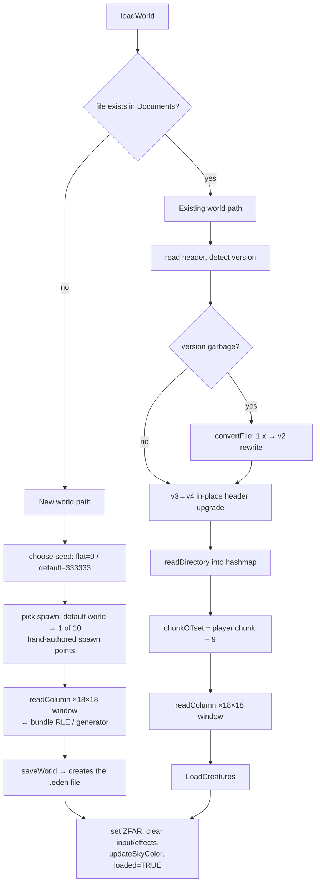

# Save / Load Pipeline

## Purpose
How world files are opened, streamed, saved and migrated at runtime. The on-disk
format itself is specified in [eden-file-format.md](eden-file-format.md).

## Important files & types
- `Classes/FileManager.mm/.h` — everything: `loadWorld`, `saveWorld`, `readColumn`,
  `saveColumn`, directory management, legacy conversion, plus the offline
  `saveGenColumn`/`writeGenToDisk` used by the world generator.
- `Classes/FileManagerHelper.mm` — read-only access to the **bundled** default world
  `Eden.eden` (its own file handle, header and directory hashmap; the comment at the
  top warns the identically-named statics refer to the *default* world, not the
  active one).
- `Classes/hashmap.mm` — int-keyed hashmap holding `ColumnIndex*` records.
- File-scope statics in `FileManager.mm`: `saveFile` (NSFileHandle), `sfh` (in-memory
  header), `indexes` (directory hashmap), `cur_dir_offset`, `file_version`,
  `imgHash`. **The FileManager is effectively a singleton with global mutable state**
  — two worlds can never be open at once.

## Load flow — `FileManager::loadWorld(name, fromArchive)` (`FileManager.mm:1346`)

Notes:
- New-world types: the `g_terrain_type` switch is hardwired to 9 (`gen_default`);
  types 0–8 (dirt/rivers/mountains/desert/ponies/beach/mix/flat) are the offline
  generator's biome recipes and are only reachable by editing the code. The menu's
  "flat world" option sets `genflat` → seed 0.
- The 10 default spawn points (`spx/spz/spy/spyaw` arrays, `FileManager.mm:1425`) are
  hand-picked scenic locations; consecutive new worlds avoid repeating the last one.
- `player->pos`/`yaw`, `home`, seed, golden cubes, region sky colors all come from the
  header. `chunkOffsetX/Z` (the render-origin/streaming anchor owned by FileManager)
  is derived from the player position.

## Column streaming — `readColumn(cx, cz, fileHandle)` (`FileManager.mm:802`)

Resolution order for a requested column:
1. **Directory hit** → seek `chunk_offset`, read 4 chunks of raw type+color bytes
   into the (reused) `TerrainChunk` objects, memcpy type strips into `blockarray`,
   `ter->addChunk(...)` marks the chunk + neighbours dirty for meshing.
2. **Directory miss, seed == 333333** → `fmh_readColumnFromDefault`: same procedure
   against the bundled `Eden.eden`, RLE-decoding and transposing each chunk. If even
   the bundle lacks the column (outside the generated 2880×2880 area) →
   `generateEmptyColumn` (air).
3. **Directory miss, other seed** → `TerrainGenerator::generateColumn` (flat-world
   layers; see [terrain-generation.md](terrain-generation.md)).

Called from two places: initial load (18×18 loop in `loadWorld`) and the per-frame
streaming check in `Terrain::prepareAndLoadGeometry` (which opens a fresh read-only
NSFileHandle each streaming event).

## Save flow — `FileManager::saveWorld(warpPos)` (`FileManager.mm:366`)

1. `terrain->endDynamics(TRUE)` — extinguish fires, clear liquids/effects (dynamics
   are **not** persisted; a burning world saves as not-burning).
2. Rebuild header from live state (seed, home, pos←warp, yaw, golden cubes, sky
   colors, display name from the menu's selected world, image hash).
3. If the file doesn't exist: create it with a fresh header (v2 bootstrap).
4. `readDirectory()` — re-read the on-disk directory into the hashmap (source of
   truth for existing column offsets).
5. For each of the 18×18 resident columns: `saveColumn(cx,cz)`:
   - skip unless any chunk in the column has `modified` set (flags are cleared here);
   - existing directory entry → overwrite in place at its `chunk_offset`;
   - new entry → `chunk_offset = directory_offset − 12000` (i.e. where the creature
     block currently starts), `directory_offset += 32768`, `writeDirectory=TRUE`;
   - write 4×(pblocks, pcolors) raw.
6. `saveCreatures()` — `SaveModels()` fills `creatureData[200]`, written at
   `directory_offset − 12000`. (v<3 files get the block appended and become v3+.)
7. Stamp `version=4`, rewrite header at offset 0; if any column was appended,
   `fwriteDirectory()` rewrites the whole directory at `directory_offset`.

### When saves happen
- Streaming boundary crossings (before overwriting resident columns) — the frequent,
  invisible autosave.
- `warpToPoint`/`warpToHome` (portal travel, home warp) — save-with-warp then reload.
- HUD save button, exit to menu, new-world creation.
- **Not** on app background/termination.

## Legacy conversion (`convertFile`, `FileManager.mm:1302`)
1.x files (version field is garbage) are rewritten: each old column
(4 chunks × 4096 type bytes, no colors) is mapped through `convertType[31]` /
`convertColor[31]` — old baked-color block types (colored crystals/leaves/"blank"
blocks) become modern type+paint pairs — into a temp file which replaces the
original. Shows "Converting World…" in the UI via `convertingWorld`.

## Renaming, hashes, deletion
- `setName(file,display)` rewrites just the header's name field (menu rename).
- `setImageHash(md5)` rewrites the header when a new preview screenshot is taken
  (`md5.c` computes it; sharing uses it to pair world+png server-side).
- `deleteWorld` removes the file and its `.png`.
- World *files* in Documents are the identity; the display name lives only in the
  header. `Menu::loadWorlds` lists Documents and reads each header for the name.

## Common pitfalls
- **Global statics**: `sfh` sometimes points into an autoreleased NSData
  (`loadWorld`: `[[saveFile readDataOfLength:...] bytes]`) and sometimes into a
  malloc'd block (`saveWorld`). Lifetime bugs lurk if you reorder operations.
- `saveWorld` must run **before** streaming overwrites chunk contents — the call
  order in `prepareAndLoadGeometry` is deliberate.
- The directory hashmap and the file can diverge between `readDirectory()` calls;
  the code defensively re-reads it at the start of every save.
- Appended columns assume the creature block is exactly 12,000 bytes; changing
  `MAX_CREATURES_SAVED` or `EntityData` breaks every existing file.
- `twoToOne` returns 0 for out-of-range chunk coords and 0 is treated as
  "corrupt/skip" — worlds cannot extend to negative or ≥ 32768 chunk coordinates.
- Column writes are not atomic; a crash mid-save can corrupt a world (there is no
  journaling; the community's corrupted-world lore is real).
- **`FileManager::loadWorld()` bailing out early (a corrupt/truncated header) does
  NOT, by itself, stop `World::loadWorld()`'s caller from proceeding as if the load
  had succeeded.** `loadWorldThread`/`World::loadWorld` (`World.mm`) unconditionally
  advance `doneLoading` 1→2 and flip `game_mode` to `GAME_MODE_PLAY` once the loader
  thread returns, whether or not it actually populated `Terrain` — a caller that wants
  to detect "the load silently failed" (the web port's `eden_report_load_failure`,
  polled via `eden_load_failed()`) has to check that signal itself at the
  `doneLoading==2` transition and refuse to advance if it's set, or the engine renders
  a `Terrain` that was cleared-but-never-repopulated (reproducibly crashes within a
  frame or two — confirmed both headless and live-browser before this was fixed).

## Safe vs. risky to modify
- **Safe:** adding data to the `reserved` header bytes (that's what it's for —
  subtract from `reserved` as the comment instructs), new save triggers, better
  progress reporting.
- **Caution:** anything that changes `SIZEOF_COLUMN`, the 192-byte header size, the
  append arithmetic, or the `modified`-flag protocol; touching the static file-handle
  state; calling save/load from any thread but the ones that already do.
